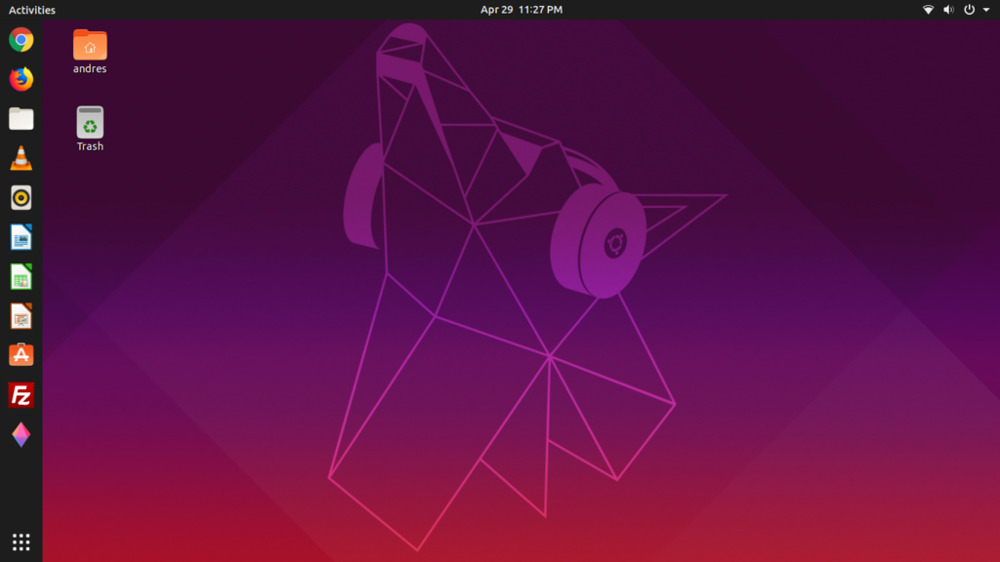

# UBUNTU

## Intro
**Ubuntu is a free and open-source Linux distribution based on Debian.** Ubuntu is officially released in three editions: Desktop, Server, and Core . All the editions can run on the computer alone, or in a virtual machine. Ubuntu is a popular operating system for cloud computing, with support for OpenStack.

Ubuntu is released every six months, with long-term support (LTS) releases every two years. The latest release is 19.04 ("Disco Dingo"), and the most recent long-term support release is 18.04 LTS ("Bionic Beaver"), which is supported until 2023 under public support and until 2028 as a paid option.

Ubuntu is developed by Canonical and the community under a meritocratic governance model.Canonical provides security updates and support for each Ubuntu release, starting from the release date and until the release reaches its designated end-of-life (EOL) date. Canonical generates revenue through the sale of premium services related to Ubuntu.

Ubuntu is named after the African philosophy of ubuntu, which Canonical translates as "humanity to others" or "I am what I am because of who we all are".

## History

Ubuntu is built on Debian's architecture and infrastructure, and comprises Linux server, desktop and discontinued phone and tablet operating system versions. Ubuntu releases updated versions predictably every six months, and each release receives free support for nine months (eighteen months prior to 13.04) with security fixes, high-impact bug fixes and conservative, substantially beneficial low-risk bug fixes. The first release was in October 2004. 

Ubuntu is currently funded by Canonical Ltd. On 8 July 2005, Mark Shuttleworth and Canonical announced the creation of the Ubuntu Foundation and provided an initial funding of US$10 million. The purpose of the foundation is to ensure the support and development for all future versions of Ubuntu. Mark Shuttleworth describes the foundation goal as to ensure the continuity of the Ubuntu project.

## Features

A default installation of Ubuntu contains a wide range of software that includes *LibreOffice, Firefox, Thunderbird, Transmission, and several lightweight games such as Sudoku and chess. Many additional software packages are accessible from the built in Ubuntu Software (previously Ubuntu Software Center) as well as any other APT-based package management tools*. Many additional software packages that are no longer installed by default, such as Evolution, GIMP, Pidgin, and Synaptic, are still accessible in the repositories still installable by the main tool or by any other APT-based package management tool. Cross-distribution snap packages and flatpaks are also available,that both allow installing software, such as some of Microsoft's software, in most of the major Linux operating systems (such as any currently supported Ubuntu version and in Fedora). The default file manager is GNOME Files, formerly called **Nautilus**.

Ubuntu operates under the **GNU General Public License (GPL)** and all of the application software installed by default is free software. In addition, Ubuntu installs some hardware drivers that are available only in binary format, but such packages are clearly marked in the restricted component. 

## Security

Ubuntu aims to be secure by default.User programs run with low privileges and cannot corrupt the operating system or other users' files. For increased security, the sudo tool is used to assign temporary privileges for performing administrative tasks, which allows the root account to remain locked and helps prevent inexperienced users from inadvertently making catastrophic system changes or opening security holes. Polkit is also being widely implemented into the desktop.

Most network ports are closed by default to prevent hacking. A built-in firewall allows end-users who install network servers to control access. A GUI (GUI for Uncomplicated Firewall) is available to configure it. Ubuntu compiles its packages using GCC features such as PIE and buffer overflow protection to harden its software.These extra features greatly increase security at the performance expense of 1% in 32-bit and 0.01% in 64-bit.

Ubuntu also supports full disk encryption as well as encryption of the home and Private directories.

## Installation

* ### Requirements

    * 64bit architecture computer with hard drive free of personal non-recoverable data. This could be any spare, old, low profile desktop or laptop.
    * Internet connection
    * DVD burner with blank DVD medium or USB flash drive of minimum 2GB size
* ### Download Ubuntu
    * First, thing we need to do is to download bootable ISO image. Note, at the time of writing the official Ubuntu 18.04 Bionic Beaver has not been released yet. From this reason we will be using daily builds. Navigate your browser to the [official Ubuntu download page](http://releases.ubuntu.com/18.04/) and download the 64-bit PC (AMD64) desktop image. 
* ### Create Bootable DVD or USB
    * Next, choose from which medium you wish to perform the Ubuntu installation. Most beginners will find using DVD as bootable medium a simpler method. If this is your case use your current operating system to burn the previously downloaded ISO image to blank DVD medium. There are no specific settings you need to choose while burning the ISO image just look for "Burn ISO image" image feature when using your burning software. 

    *Use the following guide on [how to create a bootable USB flash drive using MS Windows](https://linuxconfig.org/how-to-create-a-bootable-ubuntu-18-04-bionic-usb-stick-on-ms-windows). If you are already using Linux read here on [how to create Ubuntu USB flash drive](https://linuxconfig.org/how-to-create-a-bootable-ubuntu-18-04-bionic-usb-stick-on-linux). 

*  ### Boot from USB or DVD
    * the following guide may provide you with some hints on [how to boot your computer from USB flash drive](https://linuxconfig.org/install-ubuntu-from-usb-18-04-bionic-beaver) or the [CD/DVD](https://neosmart.net/wiki/booting-from-a-cd-or-dvd/) medium
* ### Install Ubuntu
    #### step-by step guide
    * 
    * 
    * 
    * 
    * 
    * 
    * 
    * 
    * 
    * 
    * 
    * 
    * 
    * 

#### Resource: 
*  wikipedia.com
*  linuxconfig.org